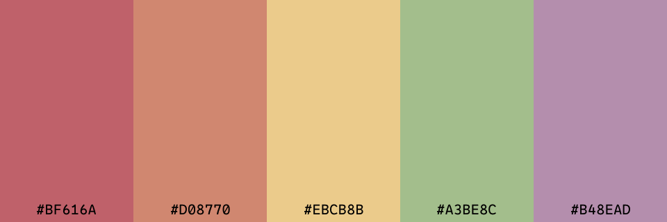
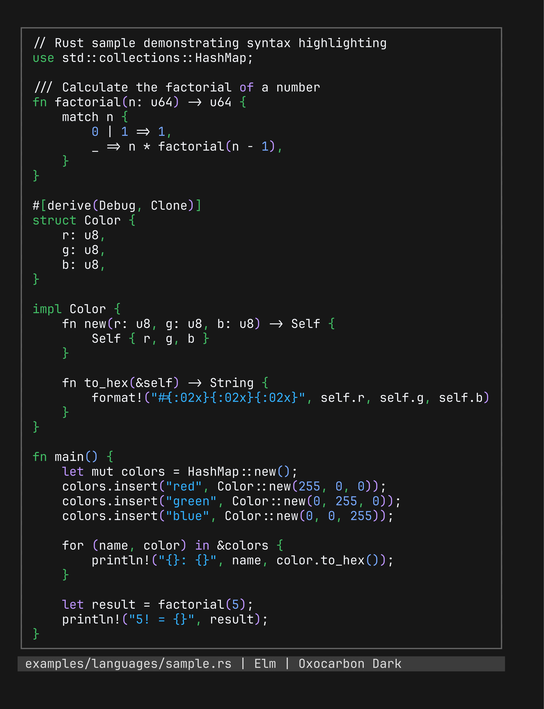

# Colorizer.rs

## Quickstart

1. Install the CLI straight from the repo:

    ```bash
    cargo install colorizer --git https://github.com/stormlightlabs/colorizer
    ```

2. Generate a golden-ratio palette and print it as hex:

    ```bash
    colorizer palette random --method golden --count 6 --format hex
    ```

3. Render it as an image:

    ```bash
    colorizer image --colors "#bf616a,#d08770,#ebcb8b,#a3be8c,#b48ead" --output palette.png --label hex
    ```

    

4. Preview syntax highlighting in your terminal:

    ```bash
    colorizer demo code --theme-yaml examples/base16/oxocarbon-dark.yml --file examples/languages/sample.rs
    colorizer demo code --theme-yaml examples/base16/oxocarbon-dark.yml --file examples/languages/sample.elm
    ```

    | Rust                                                              | Elm                                                               |
    | ----------------------------------------------------------------- | ----------------------------------------------------------------- |
    |  |  |

## Features

- **Vim Integration**
    - Generate Vim colorschemes directly from computed or YAML-based palettes.
    - Optionally update an existing `vimrc` (injecting or switching `colorscheme`) or emit a standalone colorscheme file.

- **Terminal & Code Demos**
    - Use `syntect` for syntax-highlighted code samples driven by your generated palette.
    - Render colored output in the terminal with `owo-colors` truecolor styling.
    - "Demo" mode to quickly preview how a palette feels on real code and in terminal UI.

### Palettes

- **Generation**
    - Generate color palettes from one or more input colors.
    - Support for deterministic harmonies (e.g., complementary, triadic) and fully random palettes.
    - Load Base16 and Base24 palettes from YAML and convert them into internal palettes.
- **Visualization**
    - Render palette previews as images with vertical color bars.
    - Automatically choose white or black text on each bar for optimal readability.
    - Export high-resolution PNGs suitable for docs, theming previews, or social media.
