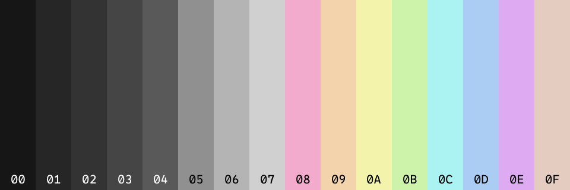
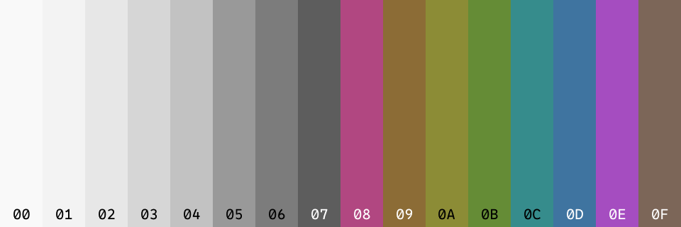
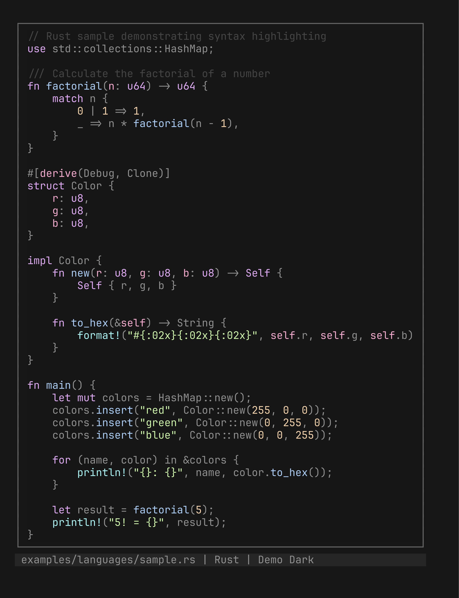
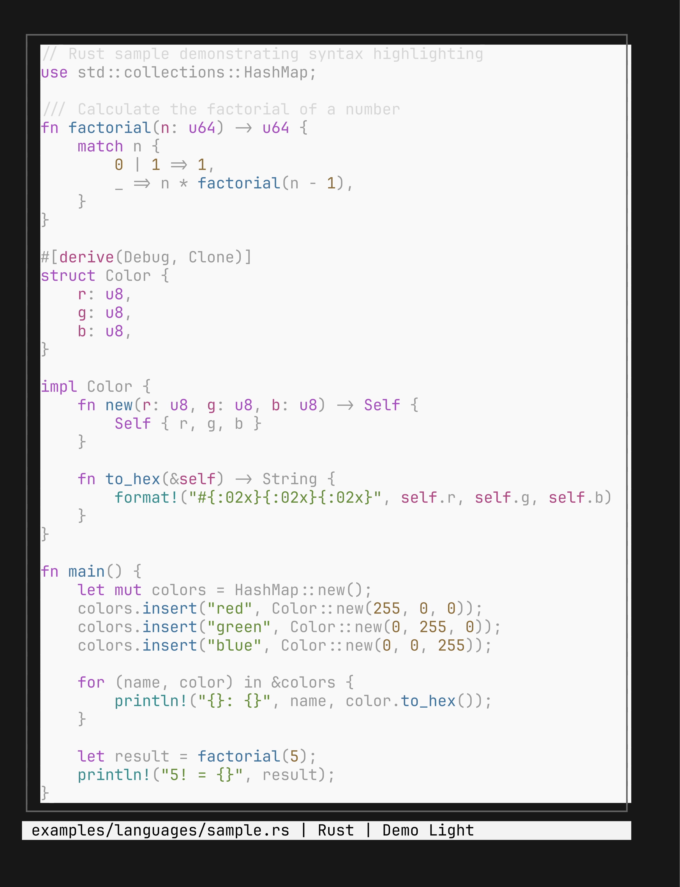

# Colorizer.rs

Colorizer.rs is a command line tool for generating & previewing color palettes and semantic color schemes (Base16/Base24) from a single accent color.

## Features

- **Vim Integration** (*todo*)
    - Generate Vim colorschemes directly from computed or YAML-based palettes or update an existing `vimrc`
- **Code Samples & Swatches**
    - Render colored (syntax-highlighted) output in the terminal with truecolor styling.
- **Generation**
    - Generate color palettes from one or more input with deterministic harmonies or fully random palettes.
- **Visualization**
    - Render palette previews as PNG swatches or in the terminal.
- **Base16/Base24 generation**
    - Produce semantic schemes directly from a single accent color and a harmony strategy

## Quickstart

1. Install the CLI straight from the repo:

    ```bash
    cargo install colorizer --git https://github.com/stormlightlabs/colorizer
    ```

2. Sample candidate accent colors with the randomizer (uniform for truly random colors, golden for deterministic sequences, Poisson when you want stricter spacing).

    Pick your preferred hex for the next steps:

    ```bash
    # Uniform random colors
    colorizer palette random --count 5 --format hex

    # Deterministic sequences
    colorizer palette random --method golden --count 5 --format hex

    # Poisson-disc spaced colors - higher min-delta-e means more separation
    colorizer palette random --method poisson --count 6 --min-delta-e 3 --format hex

    # Or save directly to an image
    colorizer palette random --count 5 --format hex --label hex --save-image palette.png

    # Optional: Save the any colors as an image
    colorizer image --colors "#590000,#7b001a,#ac003a,#da0061,#fa007e,#ff23a9" --out palette.png
    ```

3. Generate a dark Base16 scheme from the chosen accent (neutrals stay ≤10% saturation so backgrounds remain gray):

    ```bash
    colorizer scheme generate base16 --name "Demo Dark" --accent "#61afef" \
      --variant dark --harmony triadic --output demo-dark.yml
    ```

4. Generate the matching light scheme from the same accent:

    ```bash
    colorizer scheme generate base16 --name "Demo Light" --accent "#61afef" \
      --variant light --harmony triadic --output demo-light.yml
    ```

    > Tip: Use `--neutral-depth` to shift between classic bright backgrounds (`0.0`) and the moodier defaults (`1.0`).
    > See *[concepts](./docs/src/concepts.md)* for ready-made values (Oxocarbon, Catppuccin, etc.).

5. Validate both YAML files to confirm neutral saturation and WCAG contrast targets:

    ```bash
    colorizer scheme validate demo-dark.yml
    colorizer scheme validate demo-light.yml
    ```

6. Render each scheme as an image (swap filenames as needed), then drop screenshots where indicated:

    ```bash
    colorizer scheme show demo-dark.yml --format image --output demo-dark.png
    colorizer scheme show demo-light.yml --format image --output demo-light.png
    ```

     

7. Display both schemes in your terminal to sanity-check ordering and contrast:

    ```bash
    colorizer scheme show demo-dark.yml --format terminal
    colorizer scheme show demo-light.yml --format terminal
    ```

8. Preview syntax highlighting driven by the same schemes (swap files/languages as needed):

    ```bash
    colorizer preview code --theme-yaml demo-dark.yml --file examples/languages/sample.rs
    colorizer preview code --theme-yaml demo-light.yml --file examples/languages/sample.rs
    ```

    | Rust (dark)                                               | Rust (light)                                                |
    | --------------------------------------------------------- | ----------------------------------------------------------- |
    |  |  |

For deeper dives into harmonies, neutral depth values, and randomization strategies, see *[concepts](./docs/src/concepts.md)*.
